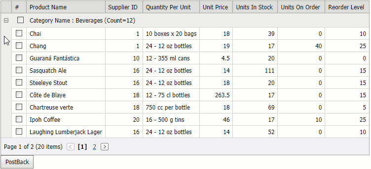

<!-- default badges list -->
[](https://supportcenter.devexpress.com/ticket/details/E1760)
[](https://docs.devexpress.com/GeneralInformation/403183)
<!-- default badges end -->
# Grid View for ASP.NET Web Forms - How to select/deselect all rows in a group when the control is grouped by a column
<!-- run online -->
**[[Run Online]](https://codecentral.devexpress.com/e1760/)**
<!-- run online end -->
This example demonstrates how to allow users to add/remove all rows in a group to/from selection. Note that this technique works only when [Grid View](https://docs.devexpress.com/AspNet/5823/components/grid-view?p=netframework) data is grouped by one column.



## Overview

Follow the steps below to allow users to select or deselect all rows in a group:

1. Create the [Grid View](https://docs.devexpress.com/AspNet/DevExpress.Web.ASPxGridView?p=netframework) control, populate it with columns, and bind the control to a data source. To group data by a column, specify the column's [GroupIndex](https://docs.devexpress.com/AspNet/DevExpress.Web.GridViewDataColumn.GroupIndex?p=netframework) property. The Grid View's [GroupSummary](https://docs.devexpress.com/AspNet/DevExpress.Web.ASPxGridView.GroupSummary) property allows you to display summary items in group rows:

    ```aspx
    <dx:ASPxGridView ID="Grid" runat="server" DataSourceID="GridDataSource" KeyFieldName="ProductID"
    ClientInstanceName="Grid" OnCustomCallback="Grid_CustomCallback" OnHtmlRowPrepared="Grid_HtmlRowPrepared">
        <Columns>
            <dx:GridViewDataComboBoxColumn Caption="Category Name" FieldName="CategoryID" GroupIndex="0">
                <PropertiesComboBox ValueField="CategoryID" TextField="CategoryName" 
                    DataSourceID="CategoryDataSource" ValueType="System.Int32" />
            </dx:GridViewDataComboBoxColumn>
            <!-- ... -->
        </Columns>
        <GroupSummary>
            <dx:ASPxSummaryItem FieldName="CategoryName" SummaryType="Count" />
        </GroupSummary>
        <!-- ... -->
    </dx:ASPxGridView>
    <asp:AccessDataSource ID="GridDataSource" runat="server" DataFile="~/App_Data/nwind.mdb"
        SelectCommand="SELECT [ProductID], [ProductName], [SupplierID], [CategoryID], [QuantityPerUnit], [UnitPrice], [UnitsInStock], [UnitsOnOrder], [ReorderLevel], [Discontinued] FROM [Products]" />
    <asp:AccessDataSource ID="CategoryDataSource" runat="server" DataFile="~/App_Data/nwind.mdb"
        SelectCommand="SELECT * FROM [Categories]" />
    ```

2. Place the [Check Box](https://docs.devexpress.com/AspNet/11415/components/data-editors/checkbox) and [Label](https://docs.devexpress.com/AspNet/11590/components/data-editors/label) controls in the Grid View's [GroupRowContent](https://docs.devexpress.com/AspNet/DevExpress.Web.GridViewTemplates.GroupRowContent?p=netframework) template. Implement two-way data binding between the label's [Text](https://docs.devexpress.com/AspNet/DevExpress.Web.ASPxLabel.Text) property and group row markup: 

    ```aspx
    <dx:ASPxGridView ID="Grid" runat="server" DataSourceID="GridDataSource" ClientInstanceName="Grid">
        <!-- ... -->
        <Templates>
            <GroupRowContent>
                <dx:ASPxCheckBox ID="checkBox" runat="server" />
                <dx:ASPxLabel ID="CaptionText" runat="server" Text='<%# GetCaptionText(Container) %>' />
            </GroupRowContent>
        </Templates>
    </dx:ASPxGridView>
    ```

    ```cs
    protected string GetCaptionText(GridViewGroupRowTemplateContainer container) {
        string captionText = !string.IsNullOrEmpty(container.Column.Caption) ? container.Column.Caption : container.Column.FieldName;
        return string.Format("{0} : {1} {2}", captionText, container.GroupText, container.SummaryText);
    }
    ```

3. Handle the Grid View control's [HtmlRowPrepared](https://docs.devexpress.com/AspNet/DevExpress.Web.ASPxGridView.HtmlRowPrepared?p=netframework) event. In the event handler, access the current group row's check box and specify its [Checked](https://docs.devexpress.com/AspNet/DevExpress.Web.ASPxCheckBox.Checked?p=netframework) property. Set the [CheckedChanged](https://docs.devexpress.com/AspNet/DevExpress.Web.ASPxCheckBox.CheckedChanged) event of the check box to a function that sends the visible index of the group row and the check state of the check box as callback parameters to the server:

    ```cs
    protected void Grid_HtmlRowPrepared(object sender, ASPxGridViewTableRowEventArgs e) {
        if(e.RowType == GridViewRowType.Group) {
            ASPxCheckBox checkBox = Grid.FindGroupRowTemplateControl(e.VisibleIndex, "checkBox") as ASPxCheckBox;
            if(checkBox != null) {
                checkBox.ClientSideEvents.CheckedChanged = string.Format("function(s, e){{ Grid.PerformCallback('{0};' + s.GetChecked()); }}", e.VisibleIndex);
                checkBox.Checked = GetChecked(e.VisibleIndex);
            }
        }
    }

    protected bool GetChecked(int visibleIndex) {
        for(int i = 0; i < Grid.GetChildRowCount(visibleIndex); i++) {
            bool isRowSelected = Grid.Selection.IsRowSelectedByKey(Grid.GetChildDataRow(visibleIndex, i)["ProductID"]); 
            if(!isRowSelected)
                return false;
        }
        return true;
    }
    ```

4. Handle the Grid View's [CustomCallback](https://docs.devexpress.com/AspNet/DevExpress.Web.ASPxGridView.CustomCallback?p=netframework) event to process the callback. Call the Grid View's [GetChildDataRow](https://docs.devexpress.com/AspNet/DevExpress.Web.ASPxGridView.GetChildDataRow(System.Int32-System.Int32)?p=netframework) method to get a data row that belongs to the current group. Pass the data row's key and the check state of the checkbox to the [SetSelectionByKey](https://docs.devexpress.com/AspNet/DevExpress.Web.Data.WebDataSelection.SetSelectionByKey(System.Object-System.Boolean)?p=netframework) method to select or deselect this row:

    ```cs
    protected void Grid_CustomCallback(object sender, ASPxGridViewCustomCallbackEventArgs e) {
        string[] parameters = e.Parameters.Split(';');
        int index = int.Parse(parameters[0]);
        bool isGroupRowSelected = bool.Parse(parameters[1]);
        for(int i = 0; i < Grid.GetChildRowCount(index); i++) {
            DataRow row = Grid.GetChildDataRow(index, i);
            Grid.Selection.SetSelectionByKey(row["ProductID"], isGroupRowSelected);
        }
    }
    ```

## Files to Review

* [Default.aspx](./CS/WebSite/Default.aspx) (VB: [Default.aspx](./VB/WebSite/Default.aspx))
* [Default.aspx.cs](./CS/WebSite/Default.aspx.cs) (VB: [Default.aspx.vb](./VB/WebSite/Default.aspx.vb))

## Documentation

* [Group Data](https://docs.devexpress.com/AspNet/3715/components/grid-view/concepts/group-data)
* [Callbacks](https://docs.devexpress.com/AspNet/402559/common-concepts/callbacks)

## More Examples

* [Grid View for ASP.NET MVC - How to select/deselect all rows in a group](https://github.com/DevExpress-Examples/gridview-how-to-implement-select-unselect-for-all-rows-in-a-group-row-t362032)
* [Grid Lookup for ASP.NET Web Forms - How to select/deselect all rows in a group](https://github.com/DevExpress-Examples/how-to-implement-select-unselect-for-all-rows-in-a-group-row-in-aspxgridlookup-t299266)
